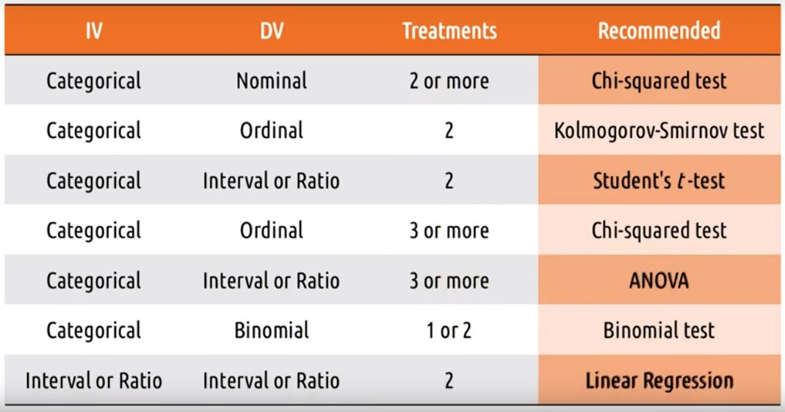

# Lesson 19

This lesson will cover the following topics:

1. **Evaluation** - where we take what we've designed and put it in front of users to get their feedback
2. **Qualitative evaluation** - e.g., what user's like and don't like
3. **Empirical evaluation** - e.g., whether the time to complete a task has changed
4. **Predictive evaluation** - predicting what the results of user evaluation will be

## Three Types Of Evaluation

- **Qualitative evaluation** - evaluation that emphasizes the totality of a phenomenon
- **Empirical evaluation** - evaluation based on numeric summaries or observations of a phenomenon
- **Predictive evaluation** - evaluation based on systematic application of pre-established principles and heuristics

## Evaluation Terminology

- **Reliability** - whether a measure consistently returns the same results for the same phenomenon
- **Validity** - whether a measure's results actually reflect the underlying phenomenon
- **Generalizability** - whether a measure's results can be used to predict phenomena beyond what it measured
- **Precision** - the level of detail a measure supplies

## 5 Tips: What To Evaluate

1. Efficiency
2. Accuracy
3. Learnability
4. Memorability
5. Satisfaction

## Evaluation Timeline

The evaluation timeline usually is as follows:

Regarding purpose:

1. **Formative** - primary purpose is to help redesign and improve our interface
2. **Summative** - the intention of conclusively saying at the end what the difference was

Regarding approach:

1. Qualitative - the goal is to help us improve and understand tasks
2. Predictive - inform how we revise and improve our interface over time
3. Empirical - the goal is to demonstrate or assess change

Regarding data:

1. Qualitative - always useful to improve our interfaces
2. Quantitative - while always useful, can only arise when we have rigorous evaluations

Regarding setting:

1. Lab testing - helps us focus exclusively on the interface early on
2. Field testing - helps us focus more on the interface in context

## Evaluation Design

1. Define the task
2. Define performance measures
3. Develop the experiment
4. Recruit participants
5. Do the experiment
6. Analyze the data
7. Summarize the data

## Qualitative Evaluation

There are some questions we want to ask in this evaluation:

1. What did you like/dislike?
2. What were you thinking while using this interface?
3. What was your goal when you took that particular action?

## Designing A Qualitative Evaluation

There are options when designing a qualitative evaluation:

1. Prior experience or live demonstration?
2. Synchronous or asynchronous?
3. One interface or multiple prototypes?
4. Think aloud protocol or post-event protocol?
5. Individuals or groups?

## Capturing Qualitative Evaluation

Options to capture qualitative evaluation:

1. Video recording
2. Note-taking
3. Software logging

## 5 Tips: Qualitative Evaluation

1. Run pilot studies
2. Focus on feedback
3. Use questions
4. Instruct users what to do, not how
5. Capture satisfaction

## Empirical Evaluation

The goal of empirical evaluation is to come up with strong conclusions. Most empirical evaluations are comparisons.

## Designing Empirical Evaluation

- **Treatment** - what a participant does in an experiment
- **Between subjects design** - comparison between two groups of subjects receiving different treatments
- **Within subjects design** - comparison within one group experiencing multiple treatments
- **Random assignment** - using random chance to decide what treatment each participant receives

## Hypothesis Testing

- **Hypothesis testing** - testing whether or not the data allows us to conclude a difference exists

## Quantitative Data And Empirical Tests

Recall that there are a number of tests for quantitative data:

1. Nominal:
   - Recommended - Chi-squared test
   - Alternatively: Fisher's exact test, G-test
2. Ordinal:
   - Recommended - Kolmogorov-Smirnov test
   - Alternatively - Chi-squared test, median test
3. Interval and ratio:
   - Recommended - Student's _t_-test
   - Alternatively - MWW test, Kruskal-Wallis test

## Summary Of Empirical Tests

Below is a summary of empirical tests:

## 5 Tips: Empirical Evaluation

1. Control what you can, document what you can't
2. Limit your variables
3. Work backwards
4. Script your analyses in advance
5. Pay attention to power

## Predictive Evaluation

Predictive evaluation should only be used where we wouldn't otherwise be doing any evaluation.

## Types Of Predictive Evaluation

- **Heuristic evaluation** - each individual evaluator inspects the interface alone, and identifies places where the interface violates some heuristic
- **Model-based evaluation** - tracing through models in the context of the interface we designed (e.g., GOMS model)
- **Simulation-based evaluation** - where we might construct an AI agent that interacts with our interface in the way a human would

## Cognitive Walk-through

The most common type of predictive evaluation is actually cognitive walk-through:

- **Cognitive walk-through** - stepping through the process of interacting with an interface, mentally simulating in each stage what the user is seeing and thinking and doing

## Evaluating Prototypes

Our goal is to constantly apply multiple evaluation techniques to center our designs on the user.

## Section Quizzes

### Exercise: Evaluation Pros And Cons

Match the advantage to the method.

|                                                | Qualitative | Empirical | Predictive |
| ---------------------------------------------- | ----------- | --------- | ---------- |
| Does not required any actual users             |             |           | x          |
| Identifies provable advantages                 |             | x         |            |
| Informs ongoing design decisions               | x           |           | x          |
| Investigates the participant's thought process | x           |           | x          |
| Provides generalizable conclusions             |             | x         |            |
| Draws conclusions from actual participants     | x           | x         |            |
